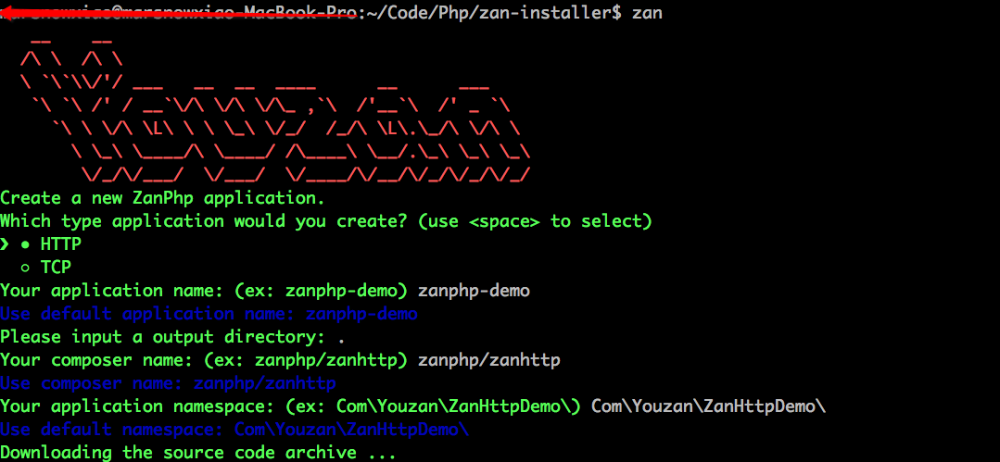
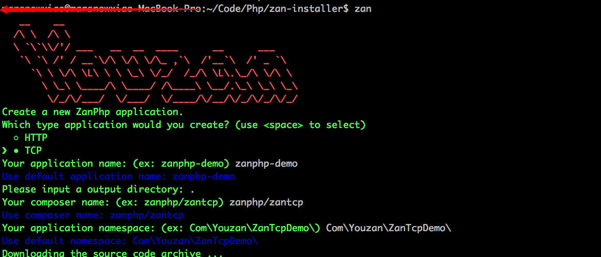
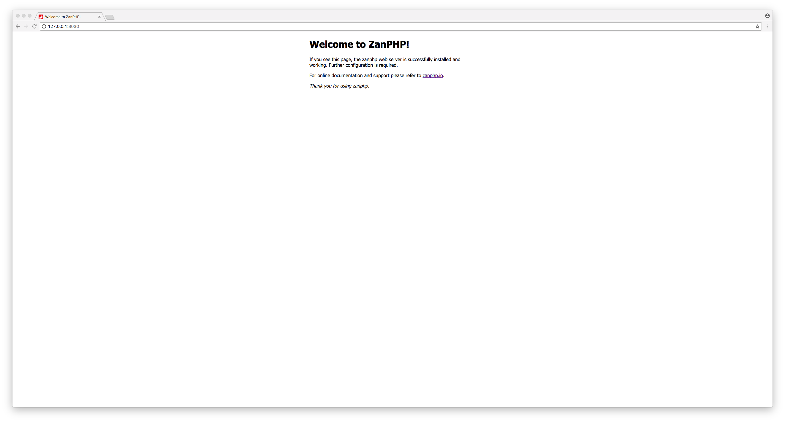
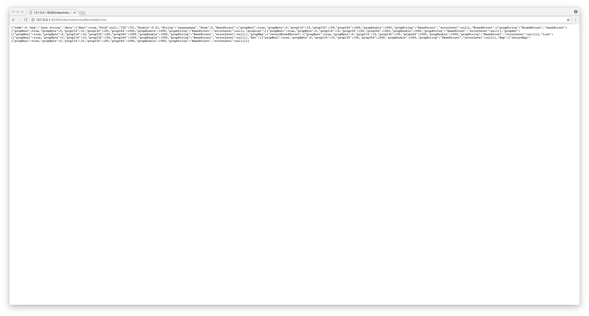

安装
==================

Zan PHP 依赖以下包

`zan <https://github.com/youzan/zan>`__

https://github.com/youzan/zan.git

`php-lz4扩展 <https://github.com/kjdev/php-ext-lz4>`__

https://github.com/kjdev/php-ext-lz4.git

`php-apcu扩展 <https://github.com/krakjoe/apcu>`__

https://pecl.php.net/package/APCu

注：zan扩展与swoole扩展不兼容，且zan是常驻进程的运行模式，不再需要opcache来提供性能提升，建议使用zan框架时关闭swoole扩展和opcache扩展配置。

扩展安装完成之后，利用脚手架`zan-installer <http://zanphp.io/guide/cli>`__ 安装zanhttpdemo和zantcpdemo。

脚手架工具 zan-installer
------------------------------

ZanPHP 提供一个官方命令行工具 zan-installer，可用于快速初始化项目目录。zan-installer提供了交互式的初始化方式，方便你快速设置应用名、项目路径、命名空间等配置。

- git clone https://github.com/youzan/zan-installer.git

- cd zan-installer

- composer install

- php ./zan

- TCP SERVER: # php bin/nova

- HTTP SERVER: # php bin/httpd

立即打开浏览器访问HTTP SERVER吧！

- NOVA RPC服务调用

(默认情形下没有开启服务拉取,需要开启resource/config/{ENV}/registry.php配置中的app_names选项)

