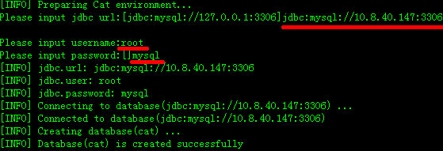
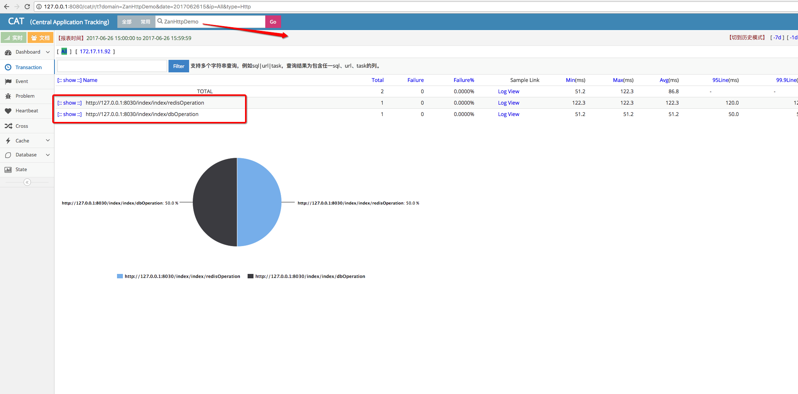
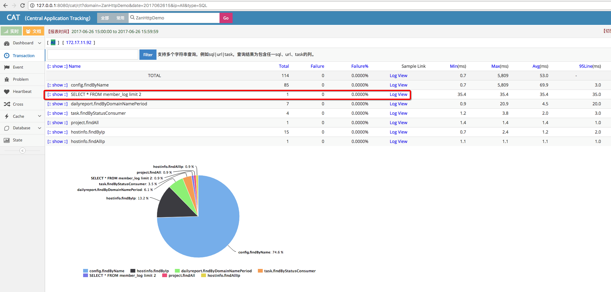

Trace
=======

本篇文档业务开发无需关心，只针对于框架开发。

为展示服务间的调用关系，明确整个请求生命周期中所经历的各个阶段，统计各请求的成功率和耗时情况，完成请求的全链路监控，zan框架实现了调用链机制。

1.初始化
~~~~~~~~

调用链会在filter中初始化，如果发现有parentId、rootId、eventId则不会生成新的rootId和parentId，这些id目前只支持通过nova协议传输，也就是说只有tcp
server才能做非第一层的调用链传递。

2.打点
~~~~~~

目前调用链已经在novaclient, db,
httpclient进行打点，后续还会继续扩大打点范围。

3.上报
~~~~~~

调用链会在TraceTerminator中进行上报数据，上报目的地址配置位于tcp连接池\ `connection/tcp.php <../pool/tcp.html>`__。

4.CAT接入
~~~~~~~~~~

目前zan框架内部Trace接入\ `CAT <https://github.com/dianping/cat.git>`__。在本地环境下，业务可以结合自身需要搭建一套CAT环境，具体步骤为：

- 运行 MAVEN 打包安装命令mvn clean install -DskipTests
- 确保/data/appdatas/cat/ 和/data/applogs/cat/目录有读写权限
- maven cat:install, 按提示输入数据库配置参数

执行完成后，会在
  + 数据库中创建cat表空间，并创建所有表结构;
  + 在/data/appdatas/cat/目录中，生成三个配置文件：client.xml、server.xml、datasources.xml
  + 修改client.xml,示例为：

.. code:: xml

  	<?xml version="1.0" encoding="utf-8"?>

	<config mode="client" xmlns:xsi="http://www.w3.org/2001/XMLSchema" xsi:noNamespaceSchemaLocation="config.xsd">
	        <servers>
	                <!-- Local mode for development -->
	                <server ip="127.0.0.1" port="2280" http-port="8080" />
	                <!-- If under production environment, put actual server address as list. -->
	                <!-- 
	                        <server ip="192.168.7.71" port="2280" /> 
	                        <server ip="192.168.7.72" port="2280" /> 
	                -->
	        </servers>
	</config>

  + 修改server.xml,示例为：

.. code:: xml
	
	<?xml version="1.0" encoding="utf-8"?>

	<!-- Configuration for development environment-->
	<config local-mode="false" hdfs-machine="false" job-machine="true" alert-machine="false">

	        <storage  local-base-dir="/data/appdatas/cat/bucket/" max-hdfs-storage-time="15" local-report-storage-time="7" local-logivew-storage-time="7">

	        </storage>

	        <console default-domain="Cat" show-cat-domain="true">
	                <remote-servers>127.0.0.1:8080</remote-servers>
	        </console>

	</config>

	<!-- Configuration for production environment -->
	<!-- Note: -->
	<!-- 1. Set local-mode false to activate remote mode. -->
	<!-- 2. If machine is job-machine, set job-machine true, you just need config only one machine. Job is offline for report aggreation, statistics report.-->
	<!-- 3. If machine is alert-machine, set alert-machine true, you just need config only one machine. -->
	<!-- 4. Cat can run without hdfs, you just config hdfs-machine false. If you have hdfs, you can config hdfs info for saving the logview info.  -->
	<!-- 5. If you don't need hdfs, the logview will be stored in local disk. You can config max local-logivew-storage-time for cleaning up old logview, the unit is day. -->
	<!-- 6. Please set hadoop environment accordingly. -->
	<!-- 7. Please set ldap info for login the system. -->
	<!-- 8. Please config remote-server if you have many cat servers. -->
	<!-- 
	<config local-mode="false" hdfs-machine="false" job-machine="false" alert-machine="false">
	        <storage  local-base-dir="/data/appdatas/cat/bucket/" max-hdfs-storage-time="15" local-report-storage-time="7" local-logivew-storage-time="7">
	                <hdfs id="logview" max-size="128M" server-uri="hdfs://10.1.77.86/user/cat" base-dir="logview"/>
	                <hdfs id="dump" max-size="128M" server-uri="hdfs://10.1.77.86/user/cat" base-dir="dump"/>
	                <hdfs id="remote" max-size="128M" server-uri="hdfs://10.1.77.86/user/cat" base-dir="remote"/>
	        </storage>

	        <console default-domain="Cat" show-cat-domain="true">
	                <remote-servers>192.168.0.1:2281,192.168.0.2:2281</remote-servers>
	        </console>

	        <ldap ldapUrl="ldap://192.168.50.11:389/DC=dianpingoa,DC=com"/>
	</config>

	-->

- 本地模式下，发布cat-home 服务

	cp /source/cat/cat-home/cat-alpha-1.3.3.war /path/to/tomcat/webapps/cat.war

- 添加监听端特征域配置文件

	在/path/to/tomcat/webapps/WEB-INF/classes/META-INF中，修改app.properties文件，文件内容为

	app.name=[appname] 　

	　app.name是固定属性名，目前zan框架中的特征域名为应用的appname。

	或者修改/path/to/tomcat/webapps/WEB-INF/classes/META-INF/cat/client.xml配置文件。

	特殊域配置，优先读取app.properties文件，不存在，才读取META-INF/cat/client.xml配置文件

	特征域名称不能为：PhoenixAgent、cat-agent、AndroidCrashLog、iOSCrashLog、ALL、FrontEnd、MerchantAndroidCrashLog、MerchantIOSCrashLog、paas、SMS-RECEIVER,否则监听的数据不能正确上传到CAT服务

	特征域名为appname,可以在实时监控界面看到被监控的机器信息，否则需要在地址栏中修改请求域参数，才可看到监控数据

	http://127.0.0.1:8080/cat/r/t?domain=XXXXXXXX-domain&ip=&date=2015042416&reportType=day&op=view

- 启动应用服务器

	cd /path/to/tomcat/bin/ ./startup.sh

-  修改zanphp框架 \ `Tcp连接池配置 <../pool/tcp.html>`__，确保连接池上报至127.0.0.1:2280，访问http://127.0.0.1:8030/index/index/redisOperation和http://127.0.0.1:8030/index/index/dbOperation,最终查看效果图为：

以上针对单机开发环境搭建，多机环境和生产环境搭建需要参见\ `CAT文档 <http://unidal.org/cat/r/home?op=view&docName=index>`__。

